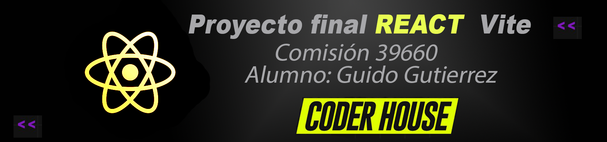
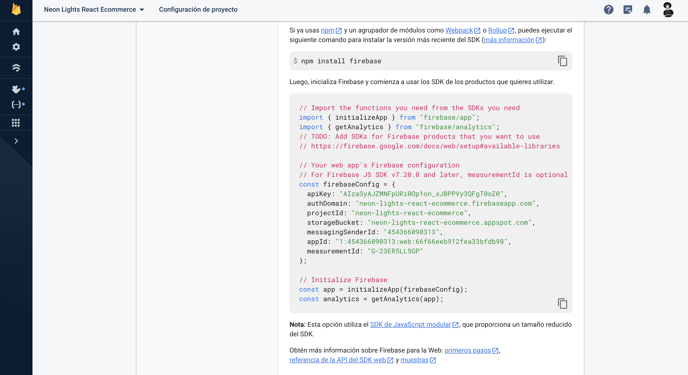
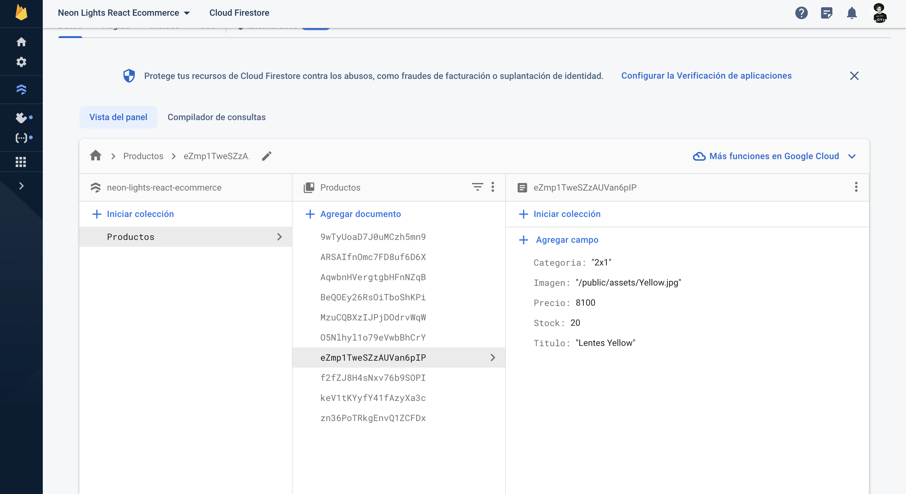
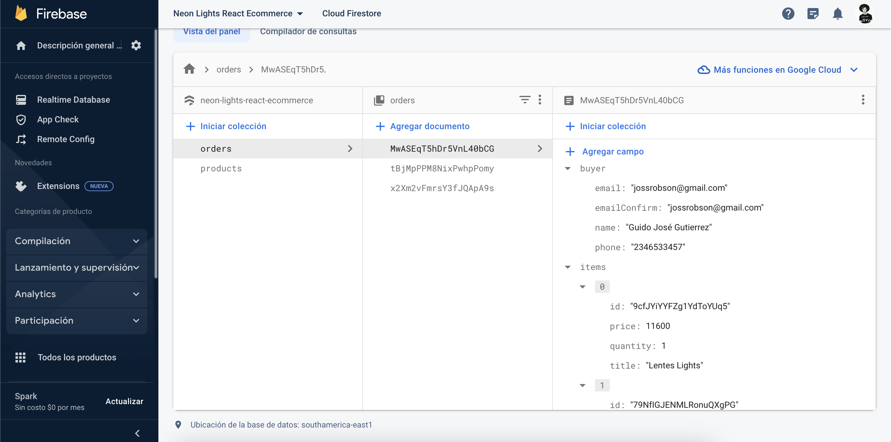

 

En este proyecto se aplicaron herramientas como:

✔️ Bootstrap  
✔️ Css  
✔️ GitHube  
✔️ Firebase - Firestore  

Las siguientes imagenes son de firebase (productos y sistema de registro de ventas)

