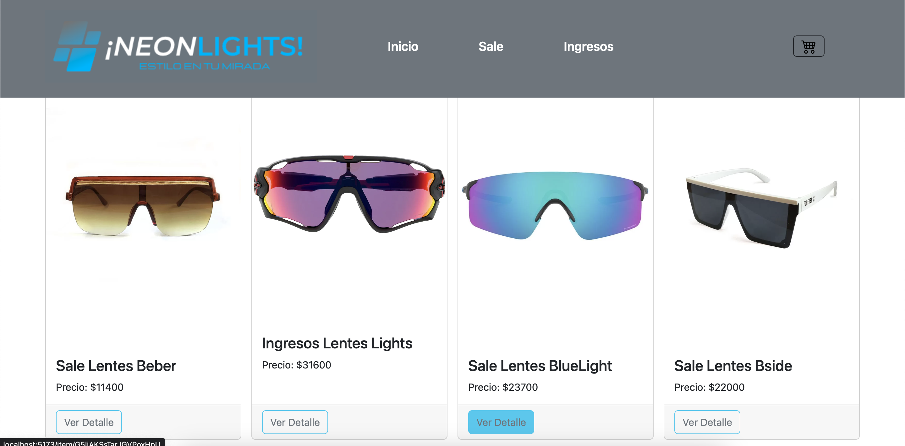
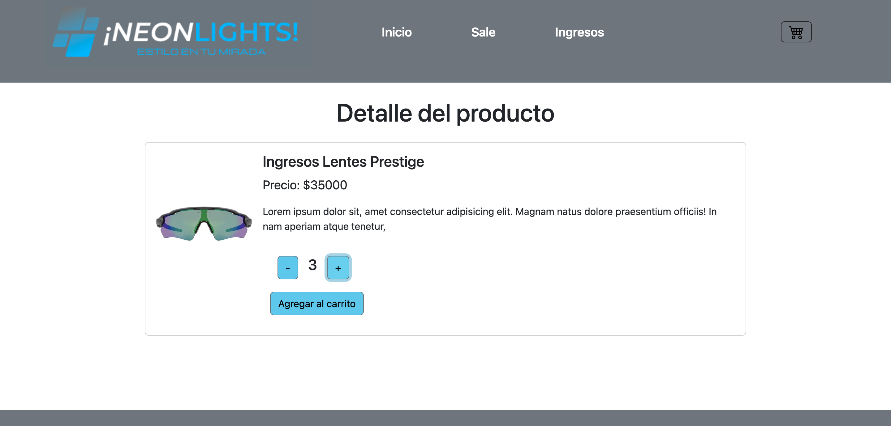
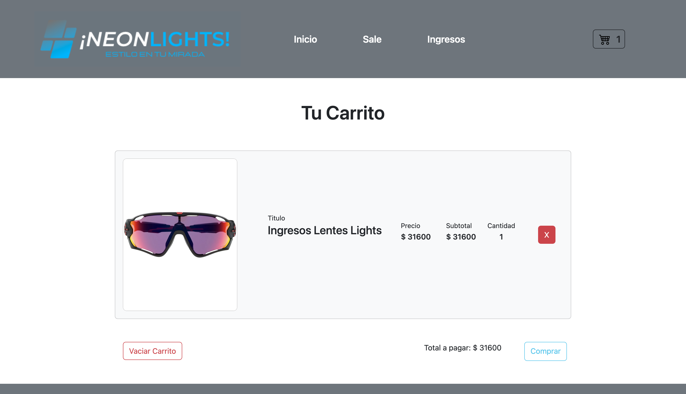
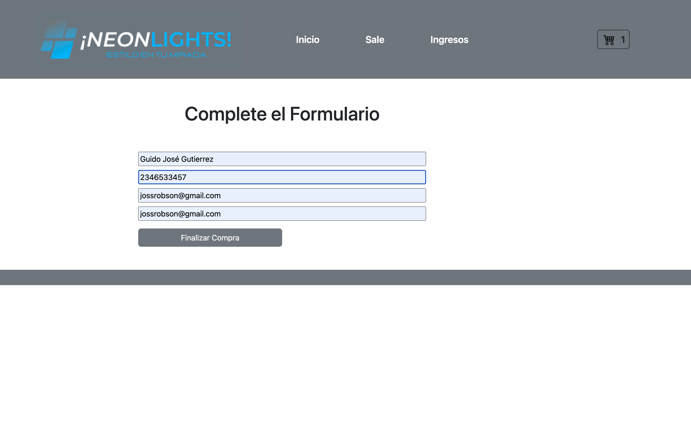

 

En este proyecto se aplicaron herramientas como:

✔️ Bootstrap  
✔️ Css  
✔️ GitHube  
✔️ Firebase - Firestore  

<h2> NeonLights Ecommerce (React Js Vite) </h2>

➖ Instalación y configuración del entorno  
➖ JSX y transpiling  
➖ Componentes  
➖ Promises, asincronía y MAP  
➖ Consumir API's (modelo cliente - servidor)  
➖ Hooks, Estados, Props, Children y Patrones  
➖ Montaje - Actualizacion - Desmontaje  
➖ Routing y navegación  
➖ Eventos (intercambiabilidad - abstraccion)  
➖ Context (Contex Provaider - Custom Provider)  
➖ Técnicas de rendering  
➖ Firebase  
➖ Optimizacion de codigo  

<h2> Descripcion del Proyecto </h2>

➕ Se trata de una Ecommerce de venta de lentes de sol, con diferentes categorias a elejir,
 en la seccion inicio se pueden ver las tarjetas con la categoria, nombre del producto, precio y un 
 "boton de detalle" que deriva a otra vista.  
 
 
 

 
 
 
➕ Todo proviniente de la base de datos de Firebase.  

<h2> Sección detalles del producto </h2>
➕ Aqui podemos ver mas informacion del producto, y encontramos que podemos incrementar o decrementar la 
cantidad a comprar y luego agregar el producto a nuestro carrito de compras, llevandonos a una nueva vista con otras opciones.

   
 <h2> Sección Ir al Carrito o Seguir Comprando </h2>

➕ Podemos ir a nuestro carrito de compras cliqueando el boton "ir al carrito" o por el "icono del carrito" que ya tiene la cantidad  de productos agrupados, o volver al inicio por medio del boton "seguir comprando" y elegir por categoria en la seccion de menu de la barra de navegacion.

<h2> Sección Carrito de Compras </h2>
➕ Esta seccion posee toda la informacion de los productos agrgados con el sub total de la compra y el total, con un boton que "elimina por item" o boton de "vaciar el carrito" 

➕

Pero si el carrito se encuentra vacio se muestra un texto informando al comprador y con un boton que lleva a comprar. Tambien consta de  boton de "Checkout" que conforme a la compra dirige a un formulario.

 <h2> Sección Formulario </h2>
➕ Esta seccion es para llenar datos del cliente, mediante un formulario, el cual valida los campos que no esten vacios.
 
➕ Tambien verifica confirmación de email y de no ser correcto informa que debe reingresarlo.
➕ Luego genera la orden de la compra.

<h2> Sección orden generada y final de compra</h2>
➕ Una vez que el cliente complete el formulario correctamente se generara la orden de compra, mostrando numero de orden y un boton que deriva nuevamente al inicio de la pagina. 

➕ La compra se envía a la base de datos de firebase con información del cliente y productos agregados al carrito.  

  

 

